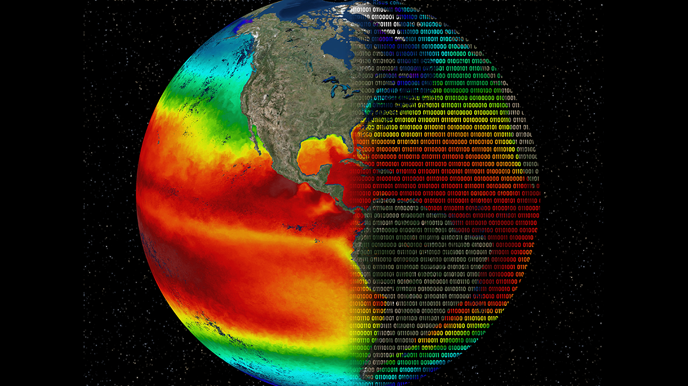

# Mathematical-Modeling-for-Climate-Research
Code for the exercises of the course "Mathematical Modeling for Climate Research" taught at FU Berlin by Prof. Dr.-Ing. Rupert Klein during the SoSe 2024

### Exercise 1 + Exercise 2
Given the advection equation
```math
$$ \phi_t + u \phi_t = 0 $$
```
and an initial condition $`\phi(0,x) = \sin(2\pi k x)`$, we develop the upwind, downwind, and central schemes for the numerical approximation of the solution. Then, we study the stability of the solutions.
<br />
<br />


